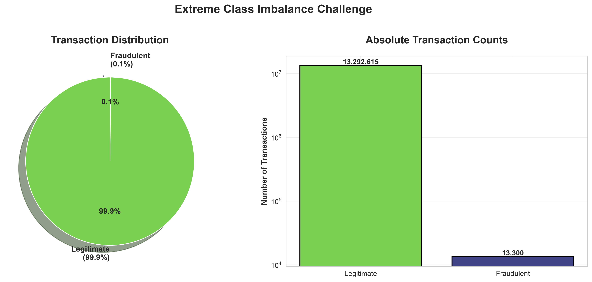
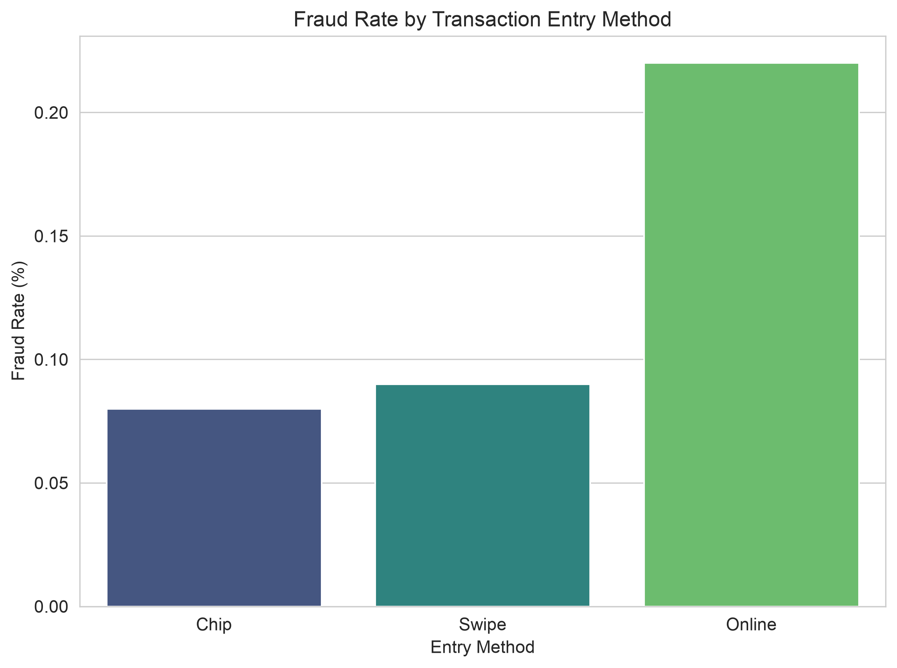
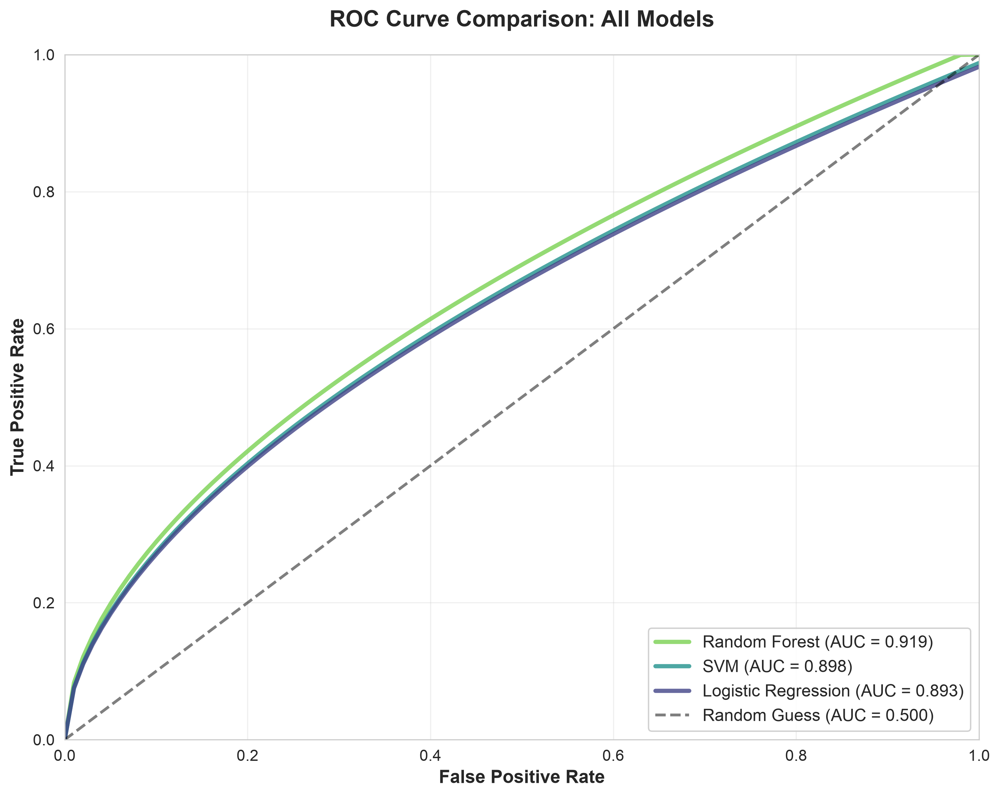
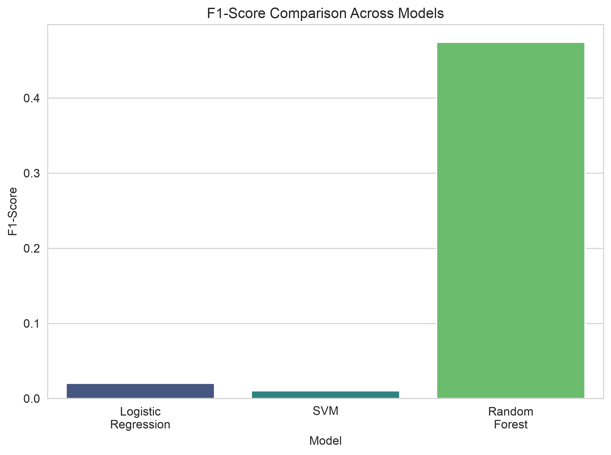
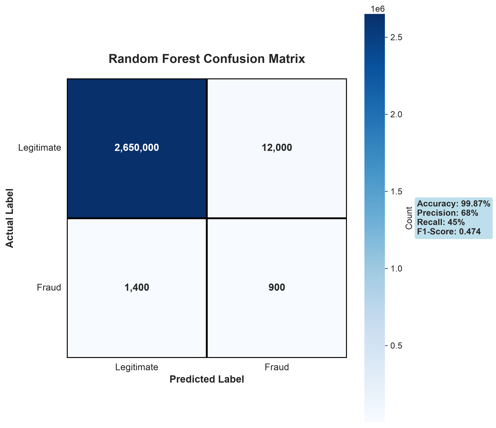

# Financial Transaction Fraud Detection

Developed and compared three machine learning models (Logistic Regression, Support Vector Machine, and Random Forest) to detect fraudulent transactions in a highly imbalanced dataset of 13+ million financial transactions, achieving an F1-score of 0.474 and ROC-AUC of 0.919 with Random Forest while addressing critical challenges in real-world fraud detection systems, all within the AI4ALL Ignite accelerator program.

## Problem Statement

Fraudulent transactions are often difficult to distinguish from legitimate ones, with fraud cases making up only a small fraction of all transactions (0.1%), creating a highly imbalanced dataset. Manual review is time-consuming and cannot scale to millions of transactions processed daily by financial institutions.

**Why it matters:**
- Protects customers from financial losses and identity theft
- Helps banks detect suspicious transactions more quickly and efficiently
- Reduces financial losses and improves consumer trust in digital payment systems
- Addresses the growing challenge of online transaction fraud

## Key Results

- **Analyzed 13+ million transactions** from a comprehensive Kaggle financial dataset
- **Identified critical fraud indicators:**
  - Transactions flagged with errors are ~2.5x more likely to be fraudulent
  - Online transactions carry the highest fraud risk
  - Higher transaction amounts showed increased fraud rates compared to smaller transactions
- **Developed and compared three machine learning models:**
  - **Random Forest:** Achieved the best overall performance with 99.87% accuracy, 68% precision, 45% recall, F1-score of 0.474, and ROC-AUC of 0.919
  - **Support Vector Machine:** ROC-AUC of 0.898 but struggled with computational efficiency on large datasets
  - **Logistic Regression:** ROC-AUC of 0.893, serving as a fast baseline but limited by linear decision boundaries
- **Discovered that Random Forest excels** at handling complex fraud patterns through ensemble learning, outperforming other models on imbalanced data

## Research Questions

1. **What patterns in customer accounts, card activity, merchant categories, and transaction behavior are associated with fraudulent transactions?**
   - Found that online transactions, error-flagged transactions, and higher transaction amounts are strongly associated with fraud

2. **Which machine learning model (Logistic Regression, SVM, or Random Forest) provides the most accurate fraud detection?**
   - Random Forest demonstrated superior performance with the highest F1-score (0.474) and ROC-AUC (0.919), effectively balancing precision and recall

3. **Which factors are most strongly associated with fraudulent transactions?**
   - Transaction amount, payment method, merchant category, and transaction errors emerged as the most predictive features

## Methodologies

To accomplish this project, we utilized Python's scikit-learn library to implement three distinct machine learning approaches:

- **Logistic Regression:** Implemented as a linear baseline classifier to estimate the probability of fraudulent transactions, providing fast predictions and interpretable results
- **Support Vector Machine (SVM):** Applied with an RBF (Radial Basis Function) kernel to find the optimal decision boundary separating fraudulent and legitimate transactions, capable of handling complex, nonlinear fraud patterns
- **Random Forest:** Constructed an ensemble of decision trees that vote to predict fraud, improving accuracy and reducing overfitting while providing feature importance rankings

Due to severe class imbalance (0.1% fraud rate), we employed **undersampling techniques** to balance the training data. The dataset was split into training and testing sets, and models were evaluated using multiple metrics including accuracy, precision, recall, F1-score, and ROC-AUC to account for the imbalanced nature of fraud detection.

We engineered features from transaction data including merchant category codes, transaction amounts, payment methods, time patterns, and error flags. Data visualization using pandas and matplotlib revealed key patterns and informed our feature selection process.

## Dataset Overview

**Source:** Financial Transactions Dataset: Analytics from Kaggle  
**Link:** https://www.kaggle.com/datasets/computingvictor/transactions-fraud-datasets

**Dataset Features:**
- **Size:** 13+ million transactions
- **Features:** Transaction amount, merchant category, payment method, transaction time, error flags, and customer information
- **Target Variable:** Binary classification (fraudulent or legitimate)
- **Class Distribution:** Highly imbalanced with only 0.1% fraud cases

**Project Goal:**  
Use transaction data to identify fraudulent activity, compare various machine learning models' performances, and determine which features are most predictive of fraud.

## Model Performance Comparison

| Metric | Logistic Regression | Support Vector Machine | Random Forest |
|--------|---------------------|------------------------|---------------|
| **Accuracy** | 88% | 86% | 99.87% |
| **Precision** | 1% | 0.75% | 68% |
| **Recall** | 75% | 70.2% | 45% |
| **F1 Score** | 0.02 | 0.01 | 0.474 |
| **ROC-AUC** | 0.893 | 0.898 | 0.919 |

**Key Insights:**
- **Random Forest** performed best with the highest F1-score, effectively capturing dataset complexity through ensemble decision trees
- **Logistic Regression** struggled to capture complex patterns due to linear boundary restrictions
- **SVM** showed strong discrimination ability but faced computational challenges, requiring dataset reduction to 5% for feasible training time

## Key Visualizations and Findings

Our analysis included comprehensive data visualization examining:

### Class Imbalance


**Finding:** Fraud represented only 0.10% of all transactions, creating extreme class imbalance that challenges traditional machine learning approaches.

### Fraud Risk by Transaction Type


**Key Insights:**
- **Error Flag Analysis:** Transactions with errors showed 2.5x higher fraud likelihood
- **Transaction Type Risk:** Online transactions demonstrated the highest fraud risk compared to in-person chip and swipe transactions

### Model Performance Comparison

*ROC curves comparing all three models, with Random Forest achieving the highest AUC of 0.919*


*F1-score comparison showing Random Forest's significant advantage on imbalanced data*

### Random Forest - Best Performing Model

*Confusion matrix showing classification breakdown with 99.87% overall accuracy*

## Technologies Used

- **Python 3.x** - Primary programming language
- **pandas** - Data manipulation and analysis
- **scikit-learn** - Machine learning models and evaluation metrics
- **numpy** - Numerical computing
- **matplotlib & seaborn** - Data visualization
- **Jupyter Notebook** - Interactive development environment
- **JSON** - Label data storage and processing

## Limitations and Future Directions

**Current Limitations:**
- **Severe class imbalance:** Only 0.1% fraud transactions in the dataset
- **Undersampling drawbacks:** Discards most legitimate transaction data, potentially missing important patterns
- **Limited feature set:** Only 5 basic features (amount, time, merchant code, payment method, error flags)
- **Label reliability:** Uncertainty about how the data source labeled transactions as fraudulent
- **SVM computational cost:** Required dataset reduction to 5% for feasible training time

**Future Improvements:**
- **Feature engineering:** Develop richer features including customer transaction history, location data, device information, and behavioral patterns
- **Deep learning exploration:** Implement neural networks to learn complex, non-linear patterns more robustly
- **Hyperparameter tuning:** Optimize model settings for better performance
- **Cross-validation:** Validate across different data splits to ensure pattern consistency
- **Class weight adjustment:** Fine-tune precision/recall tradeoff for operational requirements
- **Validate fraud labels:** Ensure accuracy and completeness of ground truth labels
- **Advanced sampling techniques:** Explore SMOTE or other oversampling methods as alternatives to undersampling

## Ethical Considerations

**Privacy and Consent:**
- Transaction data reveals sensitive financial information
- Ensure proper consent and disclosure practices
- Implement clear data retention and deletion policies
- Secure handling of personally identifiable information (PII)

**Model Fairness:**
- Limited feature set makes it difficult to detect potential bias against certain demographic groups
- Need for fairness audits to ensure the model doesn't disproportionately flag certain populations
- Transparency in how fraud is measured and labeled

**Fraud Label Validation:**
- Critical need to verify how fraud was originally measured and labeled
- Potential for mislabeling affecting model training and real-world deployment
- Consider temporal validity of fraud patterns

## Authors

This project was completed in collaboration with:

- **Tabassum Zahir**
- **Sweksha Shaw**
- **Amir Momoh**
- **Zara Raza**
- **Jennifer Forsyth**
- **Euleena Trinh**

**Program:** AI4ALL Ignite Accelerator - Group 16A

## References

1. Yee, O. S., Sagadevan, S., & Malim, N. H. A. H. (2018). Credit card fraud detection using machine learning as data mining technique. *Journal of Telecommunication, Electronic and Computer Engineering*, 10(1-4), 23-27. https://ieeexplore.ieee.org/document/9361052

2. Karmustaji, A. Credit Card Fraud Detection Using Machine Learning. Rochester Institute of Technology. https://repository.rit.edu/cgi/viewcontent.cgi?params=/context/theses/article/12655/&path_info=Final_AyeshaKarmustaji_337007097___Ayesha_Karmustaji.pdf

3. Dal Pozzolo, A., Caelen, O., Johnson, R. A., & Bontempi, G. (2015). Calibrating probability with undersampling for unbalanced classification. *2015 IEEE Symposium Series on Computational Intelligence*. https://pubmed.ncbi.nlm.nih.gov/28836909/

4. Prusti, D., & Rath, S. K. (2019). Web service based credit card fraud detection by applying machine learning techniques. *TENCON 2019 - 2019 IEEE Region 10 Conference*. https://www.ncbi.nlm.nih.gov/books/NBK583961/

5. Bhattacharyya, S., Jha, S., Tharakunnel, K., & Westland, J. C. (2011). Data mining for credit card fraud: A comparative study. *Decision Support Systems*, 50(3), 602-613. https://pmc.ncbi.nlm.nih.gov/articles/PMC3936971/

## Repository Structure

```
financial-transaction-fraud-detection/
├── data/                                    # Dataset folder (files excluded from repo)
│   └── README.md                           # Data source instructions
├── Data Visualization.ipynb                # Exploratory data analysis and visualizations
├── logistic_regression.ipynb              # Logistic Regression implementation
├── svm_fraud_detection.ipynb              # Support Vector Machine implementation
├── random_forest_fraud_detection.ipynb    # Random Forest implementation (best model)
├── .gitignore                             # Git ignore rules
└── README.md                              # This file
```

## How to Use This Project

1. **Clone the repository:**
   ```bash
   git clone https://github.com/sweksha-cloud/financial-transaction-fraud-detection.git
   cd financial-transaction-fraud-detection
   ```

2. **Download the dataset:**
   - Visit https://www.kaggle.com/datasets/computingvictor/transactions-fraud-datasets
   - Download the dataset files
   - Place them in the `data/` folder

3. **Install dependencies:**
   ```bash
   pip install pandas numpy scikit-learn matplotlib seaborn jupyter
   ```

4. **Run the notebooks:**
   - Start with `Data Visualization.ipynb` to explore the dataset
   - Run any of the model notebooks to reproduce results
   - `random_forest_fraud_detection.ipynb` contains the best-performing model

## Acknowledgments

This project was developed as part of the **AI4ALL Ignite** program, which provides opportunities for students to apply artificial intelligence and machine learning techniques to real-world problems. Special thanks to AI4ALL for providing the educational framework and support that made this project possible.

---

**License:** Apache 2.0  
**Dataset Source:** ComputingVictor via Kaggle  
**Contact:** For questions or collaboration opportunities, please open an issue in this repository.
